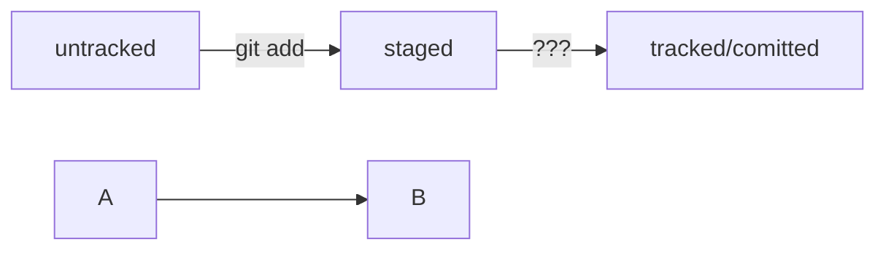

# first-project

first-project

git init
git add
git commit
git push

HEAD -- это голова.
Коммит -- это всему голова.
Статусы файлов:
<тут пустая строка!>

```mermaid
%% описание схемы
```
<и тут пустая строка!>

git log
git status
git add
git commit -m


